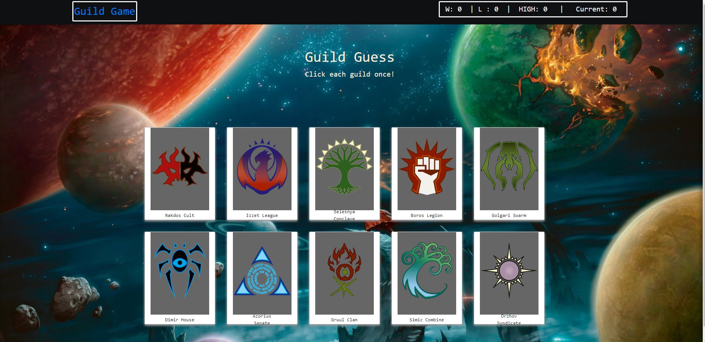

# [GuildGuessReact](https://alexlo15.github.io/guildguessreact/)
RU-SOM-FSF-FT-06-2019-U-C | HW #15
______

______

## Motivation
Create a single page clicky game using react.

## Technologies used and why

**Built with:**
* [React](https://reactjs.org/)
* [Node](https://nodejs.org/en/)
* [Bootstrap](https://getbootstrap.com/)

## npm Packages used:

* react
* react-dom
* react-scripts

## Features
Our website features: 

1. Stylish CSS
2. Win/Loss record tracking
3. Memory Match

## License
A short snippet describing the license (MIT, Apache etc)

MIT ©
[Alex Lo](https://github.com/alexlo15)

